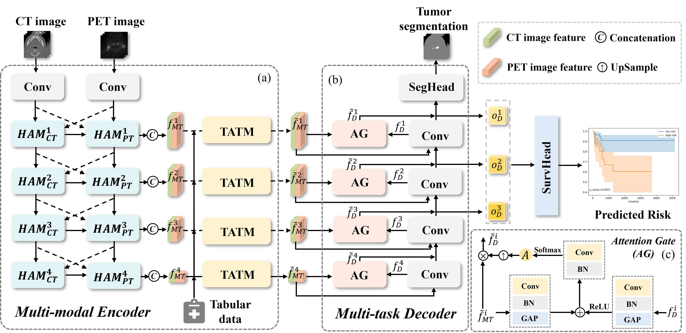

# HMT: A Hybrid Multi-Modal Transformer With Multi-Task Learning for Survival Prediction in Head and Neck Cancer


This is the official implementation of the paper "<b>HMT: A Hybrid Multi-Modal Transformer With Multi-Task Learning for Survival Prediction in Head and Neck Cancer </b>", TRPMS 2025.
<a href="https://ieeexplore.ieee.org/abstract/document/10883045">[link]</a>
   
Author: Jiaqi Cui, Yuanyuan Xu, Hanci Zheng, Xi Wu, Jiliu Zhou, Yuanjun Liu, Yan Wang




**Abstract:** Survival prediction is crucial for cancer patients as it offers prognostic information for treatment planning. However, current models face challenges in effectively utilizing heterogeneous multi-modal data (e.g., PET/CT images and clinical tabular) and extracting essential information from tumor regions, resulting in suboptimal survival prediction accuracy. To tackle these limitations, in this paper, we propose a novel hybrid multi-modal transformer model, namely HMT, for survival prediction from PET/CT images and clinical tabular in Head and Neck (H&N) cancer. Specifically, we develop Hybrid Attention Modules (HAMs) to capture intra-modal information and inter-modal correlations from multi-modal PET/CT images. Moreover, we design hierarchical Tabular Affine Transformation Modules (TATMs) to integrate supplementary insights from the heterogenous tabular with images via affine transformations. The TATM dynamically emphasizes features contributing to the survival prediction while suppressing irrelevant ones during integration. To achieve finer feature fusion, TATMs are hierarchically embedded into the network, allowing for consistent interaction between tabular and multi-modal image features across multiple scales. To mitigate interferences caused by irrelevant information, we introduce tumor segmentation as an auxiliary task to capture features related to tumor regions, thus enhancing prediction accuracy. Experiments demonstrate our superior performance. 

## Referece
```bash
@article{cui2025hmt,
  title={HMT: A Hybrid Multi-Modal Transformer With Multi-Task Learning for Survival Prediction in Head and Neck Cancer},
  author={Cui, Jiaqi and Xu, Yuanyuan and Zheng, Hanci and Wu, Xi and Zhou, Jiliu and Liu, Yuanjun and Wang, Yan},
  journal={IEEE Transactions on Radiation and Plasma Medical Sciences},
  year={2025},
  publisher={IEEE}
}
```